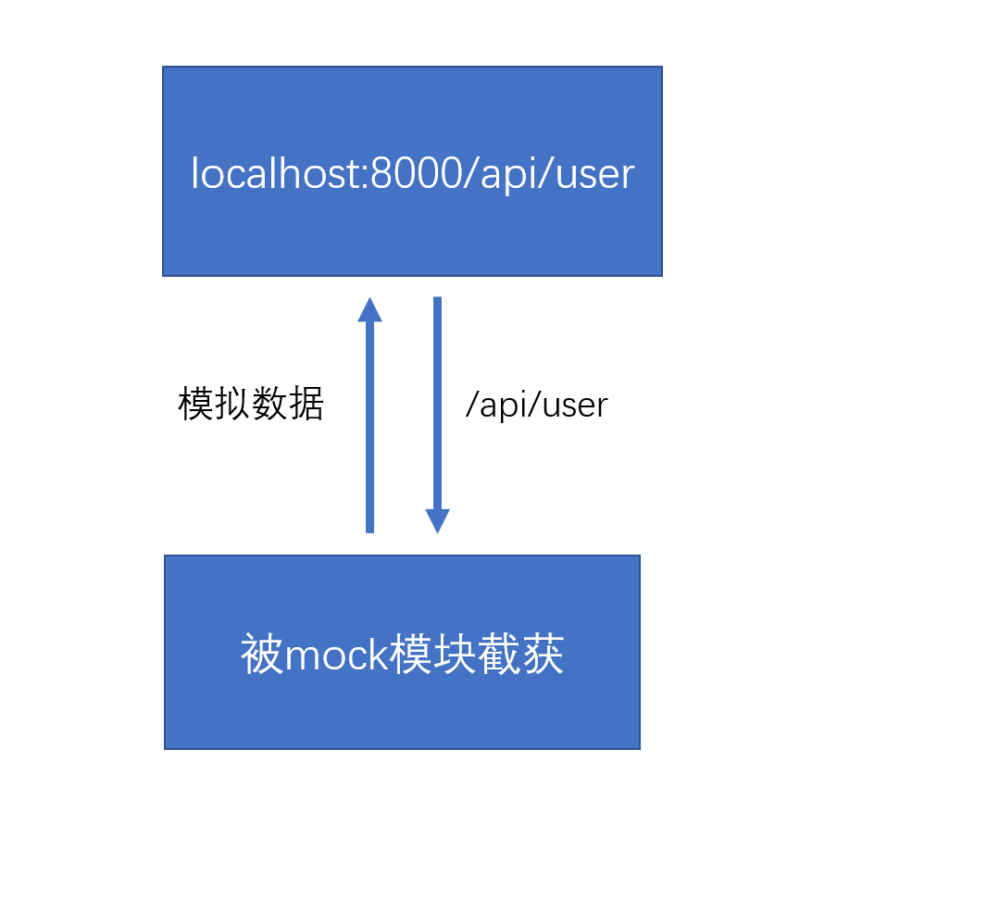
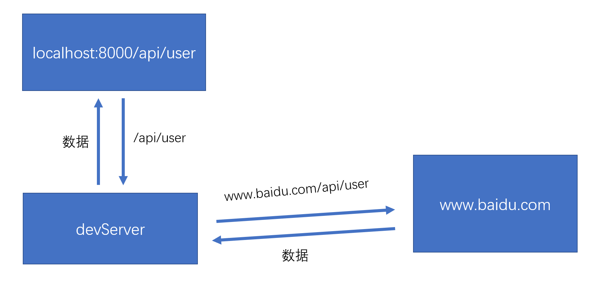

#### 数据模拟(mock)



```react
	用于解决前后端协同开发的问题
    umi中使用mock
    1.根目录下的mock文件夹中的js文件
    2.src/pages文件夹中的_mock.js文件
	以上两种js文件均会被umijs读取,并作为数据模拟的配置

mock文件下的student.js
	export default {
        "GET /api/student/findAll":{
            msg:"查询成功",
            status:"success",
            data:[2,7,8,2,454,54]
        }
    }
```


#### 代理



```react
	代理用于解决跨域请求，由于浏览器有同源策略，因此不能直接本地发请求到远程服务器。因此我们使用代理,例如发送请求/api/users,由于没有给域名以及端口号，所以默认会发送到本机服务器localhost:8000/api/users中,然后这个请求会被本地的开发服务器devServer截获到,拿到这个请求后它会根据你的配置更改域名。

umi配置devServer，在.umirc.js文件中
	export default {
        plugins:[...],
        proxy: {//相当于webpack中的devServer的proxy配置
                 "/api":{
                 	target:"http://www.baidu.com",
                 	changeOrigin:true  //修改源
                 }
                 }
    }
	
```

