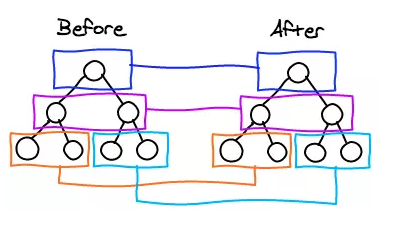

#### js模拟虚拟DOM

```js
const Vdom = {
	tag:'div',
	attrs:{
		id:'container'
	},
	children:[
        {
            tag:'h1',
            attrs:{
                class:'title'
            },
            children:['这是h1的文本信息']
        },
        {
            tag:'p',
            attrs:{
                class:'content'
            },
            children:['这是p标签的文本信息']
        }
        
    ]
}
```


#### Vue更新节点

```
渲染真实DOM的开销是很大的，比如有时候我们修改了某个数据，如果直接渲染到真实dom上会引起整个dom树的重绘和重排，有没有可能我们只更新我们修改的那一小块dom而不要更新整个dom呢？diff算法能够帮助我们。

我们先根据真实DOM生成一颗 virtual DOM ，当 virtual DOM 某个节点的数据改变后会生成一个新的 Vnode ，然后 Vnode 和 oldVnode 作对比，发现有不一样的地方就直接修改在真实的DOM上，然后使 oldVnode 的值为 Vnode 。

diff的过程就是调用名为 patch 的函数，比较新旧节点，一边比较一边给 真实的DOM 打补丁。
```


#### 真实DOM和虚拟DOM的区别

```html
virtual DOM是将真实的DOM的数据抽取出来，以对象的形式模拟树形结构。比如dom是这样的：

<div>
 <p>123</p>
</div>
```

```js
对应的virtual DOM（伪代码）：
var Vnode = {
 tag: 'div',
 children: [
  { tag: 'p', text: '123' }
 ]
};
（温馨提示： VNode 和 oldVNode 都是对象，一定要记住）
```


#### diff的比较方式

在采取diff算法比较新旧节点的时候，比较只会在同层级进行, 不会跨层级比较。

```html

<div>
 <p>123</p>
</div>
 
<div>
 <span>456</span>
</div>

```

上面的代码会分别比较同一层的两个div以及第二层的p和span，但是不会拿div和span作比较。在别处看到的一张很形象的图




#### patch

```js
来看看 patch 是怎么打补丁的（代码只保留核心部分）
function patch (oldVnode, vnode) {
 // some code
 if (sameVnode(oldVnode, vnode)) {
  patchVnode(oldVnode, vnode)
 } else {
  const oEl = oldVnode.el // 当前oldVnode对应的真实元素节点
  let parentEle = api.parentNode(oEl) // 父元素
  createEle(vnode) // 根据Vnode生成新元素
  if (parentEle !== null) {
   api.insertBefore(parentEle, vnode.el, api.nextSibling(oEl)) // 将新元素添加进父元素
   api.removeChild(parentEle, oldVnode.el) // 移除以前的旧元素节点
   oldVnode = null
  }
 }
 // some code 
 return vnode
}
```

patch函数接收两个参数 oldVnode 和 Vnode 分别代表新的节点和之前的旧节点

判断两节点是否值得比较，值得比较则执行 patchVnode

```js
function sameVnode (a, b) {
 return (
 a.key === b.key && // key值
 a.tag === b.tag && // 标签名
 a.isComment === b.isComment && // 是否为注释节点
 // 是否都定义了data，data包含一些具体信息，例如onclick , style
 isDef(a.data) === isDef(b.data) && 
 sameInputType(a, b) // 当标签是<input>的时候，type必须相同
 )
}
```

不值得比较则用 Vnode 替换 oldVnode
如果两个节点都是一样的，那么就深入检查他们的子节点。如果两个节点不一样那就说明 Vnode 完全被改变了，就可以直接替换 oldVnode 虽然这两个节点不一样但是他们的子节点一样怎么办？别忘了，diff可是逐层比较的，如果第一层不一样那么就不会继续深入比较第二层了。（我在想这算是一个缺点吗？相同子节点不能重复利用了...）


#### pathVnode

```js
当我们确定两个节点值得比较之后我们会对两个节点指定 patchVnode 方法。那么这个方法做了什么呢？

patchVnode (oldVnode, vnode) {
 const el = vnode.el = oldVnode.el
 let i, oldCh = oldVnode.children, ch = vnode.children
 if (oldVnode === vnode) return
 if (oldVnode.text !== null && vnode.text !== null && oldVnode.text !== vnode.text) {
  api.setTextContent(el, vnode.text)
 }else {
  updateEle(el, vnode, oldVnode)
  if (oldCh && ch && oldCh !== ch) {
   updateChildren(el, oldCh, ch)
  }else if (ch){
   createEle(vnode) //create el's children dom
  }else if (oldCh){
   api.removeChildren(el)
  }
 }
}
```

这个函数做了以下事情：

1. 找到对应的真实dom，称为 `el`
2. 判断 `Vnode` 和 `oldVnode` 是否指向同一个对象，
3. 如果是，那么直接 `return` 如果他们都有文本节点并且不相等，那么将 `el` 的文本节点设置为 `Vnode` 的文本节点。
4. 如果 `oldVnode` 有子节点而 `Vnode` 没有，则删除 `el` 的子节点
5. 如果 `oldVnode` 没有子节点而 `Vnode` 有，则将 `Vnode` 的子节点真实化之后添加到 `el` 如果两者都有子节点，则执行 `updateChildren` 函数比较子节点，这一步很重要

其他几个点都很好理解，我们详细来讲一下updateChildren


#### updateChildren

```js
代码量很大，不方便一行一行的讲解，所以下面结合一些示例图来描述一下。

updateChildren (parentElm, oldCh, newCh) {
 let oldStartIdx = 0, newStartIdx = 0
 let oldEndIdx = oldCh.length - 1
 let oldStartVnode = oldCh[0]
 let oldEndVnode = oldCh[oldEndIdx]
 let newEndIdx = newCh.length - 1
 let newStartVnode = newCh[0]
 let newEndVnode = newCh[newEndIdx]
 let oldKeyToIdx
 let idxInOld
 let elmToMove
 let before
 while (oldStartIdx <= oldEndIdx && newStartIdx <= newEndIdx) {
  if (oldStartVnode == null) { // 对于vnode.key的比较，会把oldVnode = null
   oldStartVnode = oldCh[++oldStartIdx] 
  }else if (oldEndVnode == null) {
   oldEndVnode = oldCh[--oldEndIdx]
  }else if (newStartVnode == null) {
   newStartVnode = newCh[++newStartIdx]
  }else if (newEndVnode == null) {
   newEndVnode = newCh[--newEndIdx]
  }else if (sameVnode(oldStartVnode, newStartVnode)) {
   patchVnode(oldStartVnode, newStartVnode)
   oldStartVnode = oldCh[++oldStartIdx]
   newStartVnode = newCh[++newStartIdx]
  }else if (sameVnode(oldEndVnode, newEndVnode)) {
   patchVnode(oldEndVnode, newEndVnode)
   oldEndVnode = oldCh[--oldEndIdx]
   newEndVnode = newCh[--newEndIdx]
  }else if (sameVnode(oldStartVnode, newEndVnode)) {
   patchVnode(oldStartVnode, newEndVnode)
   api.insertBefore(parentElm, oldStartVnode.el, api.nextSibling(oldEndVnode.el))
   oldStartVnode = oldCh[++oldStartIdx]
   newEndVnode = newCh[--newEndIdx]
  }else if (sameVnode(oldEndVnode, newStartVnode)) {
   patchVnode(oldEndVnode, newStartVnode)
   api.insertBefore(parentElm, oldEndVnode.el, oldStartVnode.el)
   oldEndVnode = oldCh[--oldEndIdx]
   newStartVnode = newCh[++newStartIdx]
  }else {
   // 使用key时的比较
   if (oldKeyToIdx === undefined) {
    oldKeyToIdx = createKeyToOldIdx(oldCh, oldStartIdx, oldEndIdx) // 有key生成index表
   }
   idxInOld = oldKeyToIdx[newStartVnode.key]
   if (!idxInOld) {
    api.insertBefore(parentElm, createEle(newStartVnode).el, oldStartVnode.el)
    newStartVnode = newCh[++newStartIdx]
   }
   else {
    elmToMove = oldCh[idxInOld]
    if (elmToMove.sel !== newStartVnode.sel) {
     api.insertBefore(parentElm, createEle(newStartVnode).el, oldStartVnode.el)
    }else {
     patchVnode(elmToMove, newStartVnode)
     oldCh[idxInOld] = null
     api.insertBefore(parentElm, elmToMove.el, oldStartVnode.el)
    }
    newStartVnode = newCh[++newStartIdx]
   }
  }
 }
 if (oldStartIdx > oldEndIdx) {
  before = newCh[newEndIdx + 1] == null ? null : newCh[newEndIdx + 1].el
  addVnodes(parentElm, before, newCh, newStartIdx, newEndIdx)
 }else if (newStartIdx > newEndIdx) {
  removeVnodes(parentElm, oldCh, oldStartIdx, oldEndIdx)
 }
}

```

先说一下这个函数做了什么,将 Vnode 的子节点 Vch 和 oldVnode 的子节点 oldCh 提取出来oldCh 和 vCh 各有两个头尾的变量StartIdx 和 EndIdx ，它们的2个变量相互比较，一共有4种比较方式。如果4种比较都没匹配，如果设置了 key ，就会用 key 进行比较，在比较的过程中，变量会往中间靠，一旦 StartIdx>EndIdx 表明 oldCh 和 vCh 至少有一个已经遍历完了，就会结束比较。